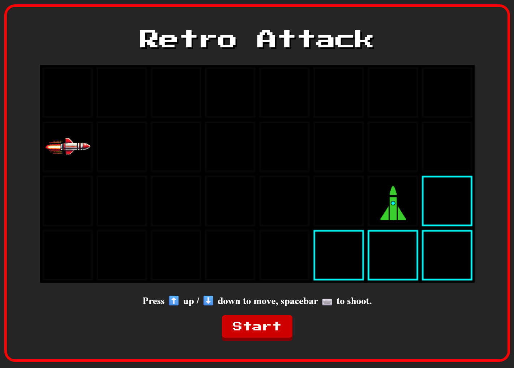

# Retro Attack

A Modern Homage to Classic Alien Attack Game.

## Table of Contents
- [Retro Attack](#retro-attack)
  - [Table of Contents](#table-of-contents)
  - [Demo](#demo)
  - [Development](#development)
    - [Prerequisites](#prerequisites)
    - [Setup](#setup)

## Demo

Try it out [here](https://albertcsm.github.io/retro-attack/)



## Development

### Prerequisites

- Node.js
- Rust

### Setup

1. Clone the repository
    ```
    git clone https://github.com/albertcsm/retro-attack.git
    ```

2. Install dependencies
    ```
    npm install
    ```

3. Run the development server
    ```
    npm run start
    ```

4. Open your browser and navigate to `http://localhost:9000` to see the game.
